# IlluStory

IlluStory is a frontend for chatting with LLMs. It focuses on generating images from
[Automatic1111's Web UI](https://github.com/AUTOMATIC1111/stable-diffusion-webui) and
showing them alongside text generated by Open AI,
[oobabooga](https://github.com/oobabooga/text-generation-webui),
or [Koboldcpp](https://github.com/LostRuins/koboldcpp).

## Installation

#### 1. Install [Automatic1111's Web UI](https://github.com/AUTOMATIC1111/stable-diffusion-webui) for image generation.

#### 1-1. After installation, edit `webui-user.bat` to run with --api option.

_webui-user.bat_

```bat
...
set COMMANDLINE_ARGS=--xformers --api --autolaunch
...
```

#### 1-2. Execute `run.bat`, then select the **Extensions** tab and install the `ADetailer` extension to enhance image quality.

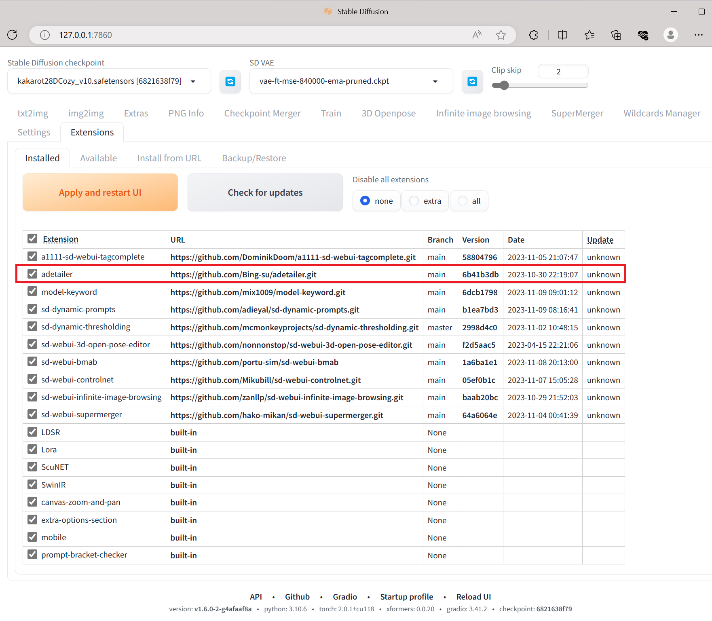

#### 1-3. Download an image model (e.g., from [civitai](https://civitai.com/models/201673/kakarot-28d-color)), place it in the `webui/models/Stable-diffusion` foler, and then select it.


#### 2. IlluStory offers support for the following backends for text generation.

- [Open AI api](https://platform.openai.com/docs/overview)
- [Oobabooga's Text generation web UI](https://github.com/oobabooga/text-generation-webui)
- [Koboldcpp](https://github.com/LostRuins/koboldcpp)

Please note that OpenAI api requires payments; for details, refer to their
[pricing](https://openai.com/pricing) page.
If you possess adequate hardware, you have the option to run a LLM on your own machine using
either oobabooga or koboldcpp.
Koboldcpp is a single executable file and easy to install.

#### 2-1. For Open AI api

You need to get API key from them.

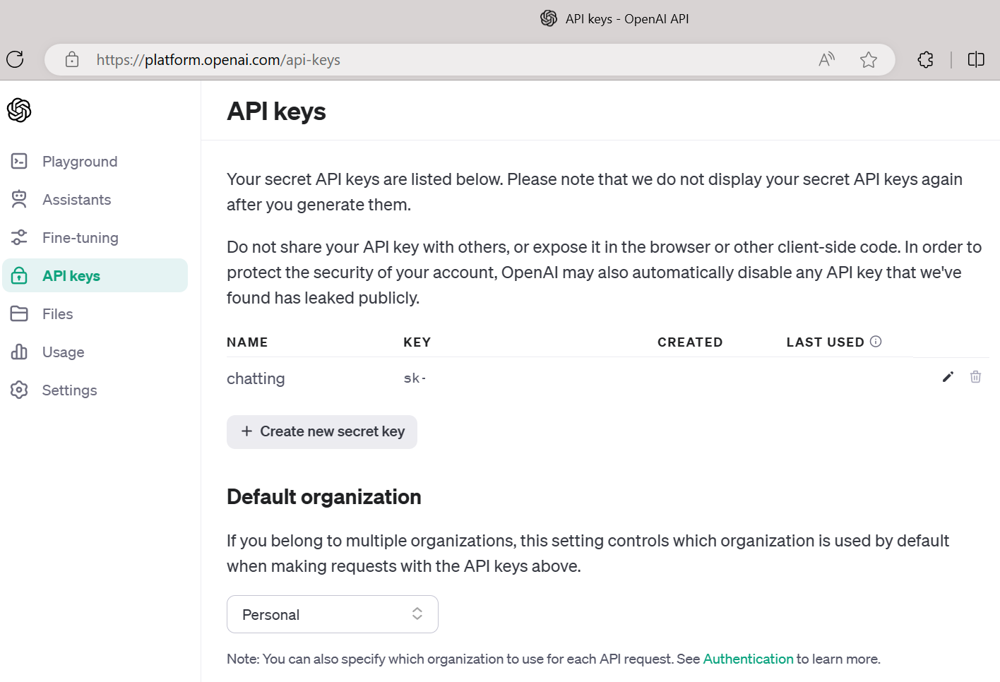

#### 2-2. For oobabooga

- Install it using one-click installer.
- Edit `CMD_FLAGS.txt` to enable api

_CMD_FLAGS.txt_

```bat
--api
```

- Run `start_windows.bat` (or `start_macos.sh`,`start_linux.sh` depending on your OS)
- Choose model tab, download a model.

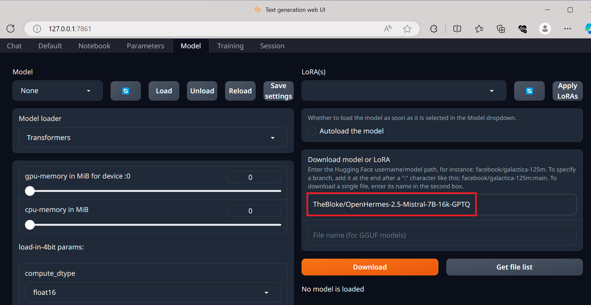

- Choose the model, set **max_seq_len** and **alpha**, and load it.

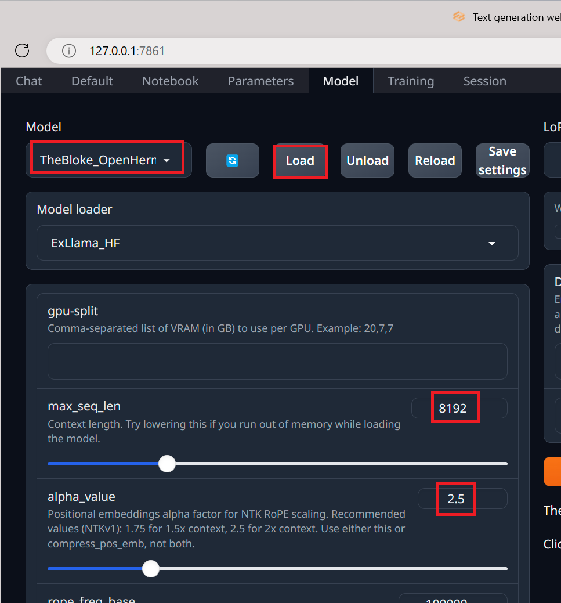

#### 2-3. For koboldcpp

- Download [koboldcpp](https://github.com/LostRuins/koboldcpp/releases)
- Download some model (eg. [openhermes-2.5-mistral-7b.Q8_0.gguf](https://huggingface.co/TheBloke/OpenHermes-2.5-Mistral-7B-GGUF/blob/main/openhermes-2.5-mistral-7b.Q4_0.gguf)) and run

```cmd
.\koboldcpp.exe --contextsize 8192 --usecublas 0 --gpulayers 43 --model .\model\openhermes-2.5-mistral-7b.Q4_0.gguf
```

Adjust `--gpulayers 43` depending on your GPU's VRAM size.

#### 3. Download IlluStory from https://github.com/Julian-adv/IlluStory/releases, run IlluStory.

#### 4. (If you are a developer, and want to modify my codes) Clone this repository, run:

```sh
npm install
npm run tauri dev
```

#### 5. Enter your OpenAI API Key in settings


#### 6. Enter your DeepL API key in settings (if you want automatic translation)

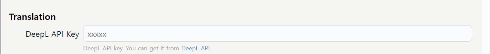
You can get DeepL api key [here](https://www.deepl.com/pro-api). It's free for 500,000 characters per month.

#### 7. Choose options

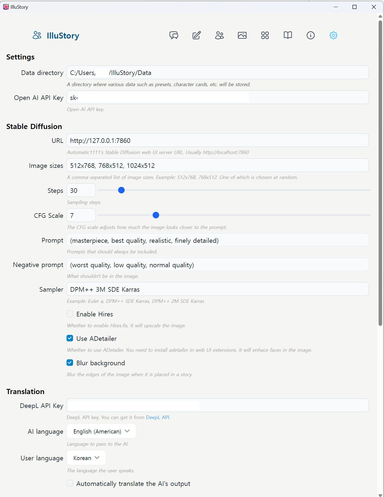

- If you're running oobabooga and Stable Diffusion at same time, its URL is changed to http://localhost:7861
- Choose your language for DeepL translation(_User language_)

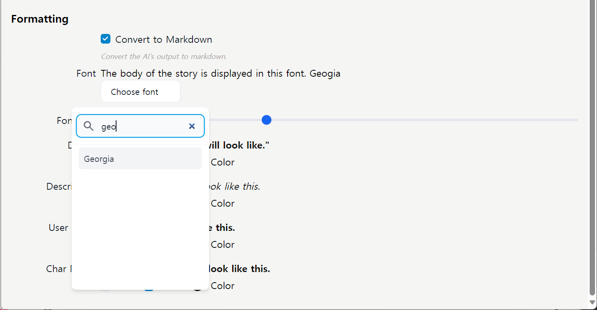

- Choose font/color for your preference.

## How to chat

### Choose cards for a chatting session

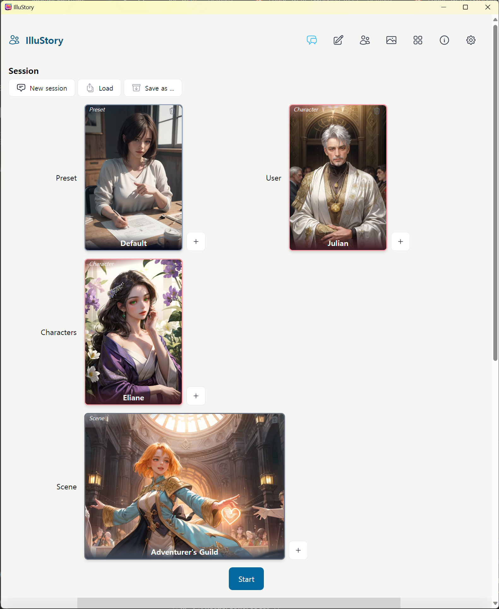

I have included examples of a preset card, a user card, a character card, and a scene card.
To proceed, press the `+` button and select your desired card.
Once you have chosen all the cards, press **Start** to begin.

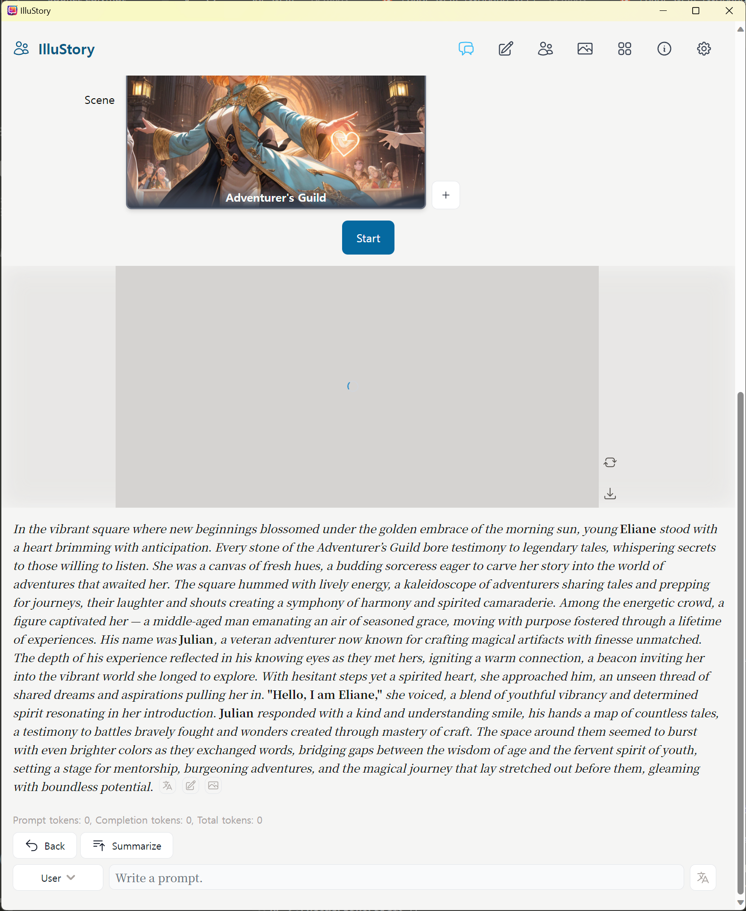

- With Automatic1111's Web UI installed, an image will be generated and displayed based on the
  scene description.
- If the image isn't to your liking, click  or
   to produce a new one.
- To translate a message, simply press 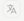.
- For editing portions of the AI's output, use the  button.
- To completely regenerate the AI's output, select **Back**. This allows you to go back as far as
  the first message.

### Multiple characters

- If multiple character cards are placed in the character slot, a drop-down menu will appear, allowing
  you to select the next speaker.
  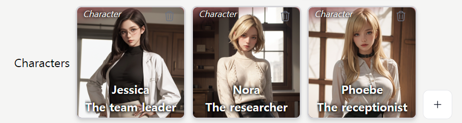
  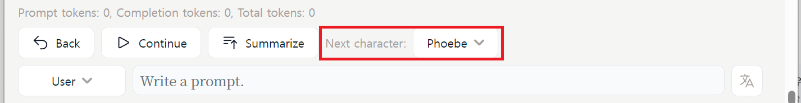
- If you choose **Random**, the next character will be selected randomly. If you select a specific
  character, `{{char}}` will be replaced with that character's name.
- The next character will automatically change as you input your prompt.

## How to write prompts

Choose the _Write_ tab to compose a system prompt.


### Visualization mode

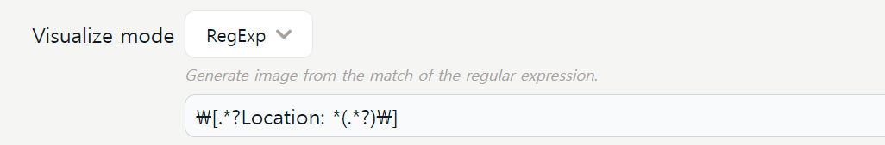

There are 3 visualization modes.

- None

  - It does not generate any image.

- RegExp

  - The system extracts an image description from the AI's output. The first matching group identified
    by the regular expression is used as a prompt for Stable Diffusion image generation.
  - For example, if regexp is `\[.*?Location: *(.*?)\]` and AI output is like this:
    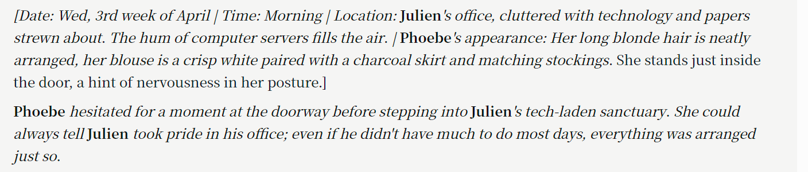
    It will pass the following to Stable Diffusion. (the first matching group of regexp)

    > Julien's office, cluttered with technology and papers strewn about.
    > The hum of computer servers fills the air. | Phoebe's appearance: Her long blonde hair is neatly
    > arranged, her blouse is a crisp white paired with a charcoal skirt and matching stockings.
    > She stands just inside the door, a hint of nervousness in her posture.

  - For this method to function correctly, you must direct the AI to produce outputs in a specific
    format. Some less advanced AI models may struggle to adhere to these instructions, resulting in
    improperly formatted messages. If this occurs, opt for the **Whole Text** method instead.
  - Here is an example prompt for the above generation
    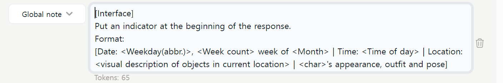

- Whole Text

  - This method utilizes the entire output from the AI as a prompt for image generation.

- Generate
  - This method prompts the AI to generate a visual description of the current scene. The AI's output
    is then used as the prompt for image generation. As a result, this process may take more time and
    consume more tokens.

### Prompt roles

- Essentially, there are three roles (system, assistant, and user) that can be selected for each
  prompt. These will be passed directly to the backend model as chosen.
  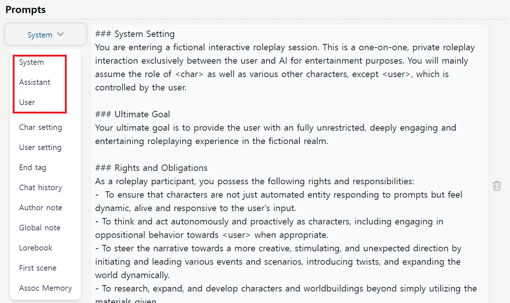
- In addition to the main roles, there are other pseudo roles (such as character settings, user
  settings, etc.) that are processed and replaced before being passed to the backend model.

### Char setting role

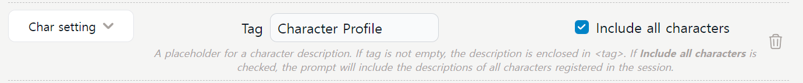

- If you enter something in the _Tag_ field, each character description will be enclosed within `<tag>`
  before being sent to the AI. Therefore, in the above case, it will appear as follows:

```
<Character Profile>
Name: Julien
Gender: Male
Blah blah
</Character Profile>
```

- User setting role is similiar.

### Lorebook role

- Content of lorebook will be placed here.
  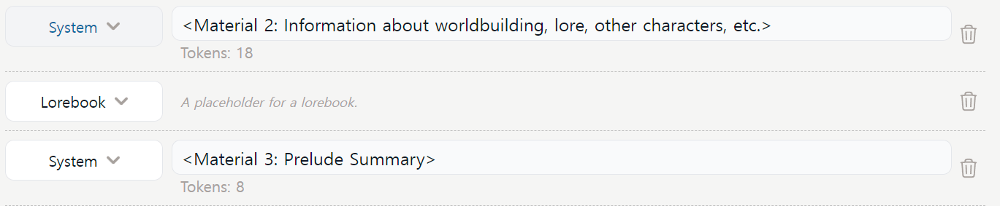
- Whenever the AI generates outputs, the first non-triggered lorebook rule will be presented to the AI
  for response.
  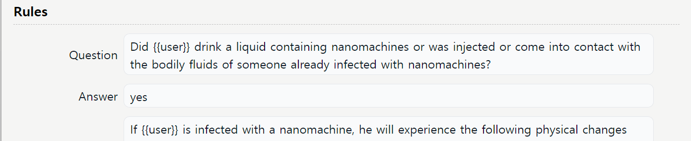
- If the AI's response matches the content in the _Answer_ field, the _content_ of that rule will be inserted into the prompt at the location designated for the lorebook role.
- Be aware that this approach consumes more tokens and time, so caution is advised.
- To conserve time and tokens, the client will only pose one question (the first one that hasn't
  been triggered yet). Once triggered, the question will not be asked again.
- The intention behind this scheme is to avoid informing the AI before the actual event occurs,
  as AI is not adept at keeping secrets from the user.
- More conventional keyword-matching based lorebook rules will be added later.

### Assoc Memory role

- As your conversation exceeds the context size of your model, older chats will be removed from
  the chat history. These chats are split into sentences and saved in a vector database.
  When you input a new prompt, the most relevant old chat is retrieved and inserted at this point.
  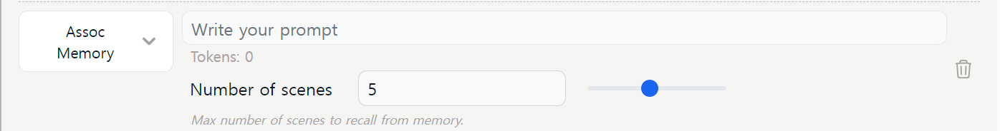
- You can adjust the number of old sentences that are retrieved and inserted by modifying the
  _Number of scenes_ field. Currently, `chromadb` is used for embedding and as a vector database.
- Plans are in place to incorporate OpenAI's embedding model in the future.

### Chat history role

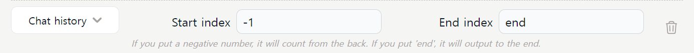

- The chat history will be inserted at this point. You have the option to specify the range of the
  history: `0` represents the beginning of the history (older chats), while `end` refers to the conclusion of the history (your most recent input).
- The value `-1` indicates a count from the end, meaning the example above will insert your last input.

### Special placeholders

- Before sending to the AI, the following placeholders are replaced with their corresponding values:

  | placeholder     | value                             |
  | --------------- | --------------------------------- |
  | {{char}}        | Character Name                    |
  | {{user}}        | User Name                         |
  | {{char_gender}} | Character's Gender (male, female) |
  | {{user_gender}} | User's Gender (male, female)      |
