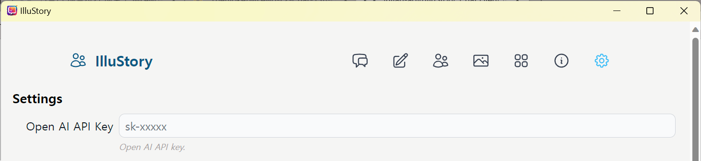

# IlluStory

IlluStory is a frontend for chatting with LLMs. This focuses on generating images from
[Automatic1111's Web UI](https://github.com/AUTOMATIC1111/stable-diffusion-webui) and
showing them alongside text generated by Open AI or
[oobabooga](https://github.com/oobabooga/text-generation-webui).

## Installation

#### 1. (Optional) Install [Automatic1111's Web UI](https://github.com/AUTOMATIC1111/stable-diffusion-webui)

#### 1-1. Run Automatic1111's Web UI with --api option.

_webui-user.bat_

```bat
set COMMANDLINE_ARGS=--xformers --api --autolaunch
```

#### 2. (Optional) Install [Oobabooga's Text generation web UI](https://github.com/oobabooga/text-generation-webui)

#### 2-1. Run oobabooga's Text generation web UI with --api option

_CMD_FLAGS.txt_

```bat
--api
```

#### 3. Download IlluStory from https://github.com/Julian-adv/IlluStory/releases, run IlluStory.

#### 4. (Developers only) Clone this repository, run:

```sh
npm install
npm run tauri dev
```

#### 5. Enter your OpenAI API Key in settings



#### 6. Enter your DeepL API key in settings (if you want automatic translation)


You can get DeepL api key [here](https://www.deepl.com/pro-api). It's free for 500,000 characters per month.

#### 7. Choose options


- Stable Diffusion URL is changed to http://localhost:7861
- Choose your language for DeepL translation(_User language_)


- Choose font/color for your preference.

#### 8. Choose cards for a chatting session


I included examples of preset card, user card, character card, and scene card.
Press **+** and choose card. After choosing all cards, press **Start**.


- If you installed Automatic1111's Web UI, it will generate and show an image from the scene description.
- If you don't like the image, press . It will regenerate a image.
- To translate message, press 
