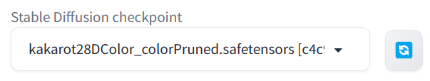

# IlluStory

IlluStory is a frontend for chatting with LLMs. It focuses on generating images from
[Automatic1111's Web UI](https://github.com/AUTOMATIC1111/stable-diffusion-webui) and
showing them alongside text generated by Open AI,
[oobabooga](https://github.com/oobabooga/text-generation-webui),
or [Koboldcpp](https://github.com/LostRuins/koboldcpp).

## Installation

#### 1. Install [Automatic1111's Web UI](https://github.com/AUTOMATIC1111/stable-diffusion-webui) for image generation.

#### 1-1. After installation, edit `webui-user.bat` to run Automatic1111's Web UI with --api option.

_webui-user.bat_

```bat
set COMMANDLINE_ARGS=--xformers --api --autolaunch
```

#### 1-2. Run `run.bat`, choose **Extensions** tab, install ADetailer extension for better image quality.


#### 1-3. Download some image model(eg. from [civitai](https://civitai.com/models/201673/kakarot-28d-color)), place it under `webui/models/Stable-diffusion` foler and choose it.



#### 2. For text generation, IlluStory supports the following backends.

- [Open AI api](https://platform.openai.com/docs/overview)
- [Oobabooga's Text generation web UI](https://github.com/oobabooga/text-generation-webui)
- [Koboldcpp](https://github.com/LostRuins/koboldcpp)

Open AI api requieres payments, refer to their [pricing](https://openai.com/pricing) page.
If you have a decent hardware you can run LLM on your own machine using oobabooga or koboldcpp.
Koboldcpp is a single exe, easy to install.

#### 2-1. For Open AI api

You need to get API key from them.


#### 2-2. For oobabooga

- Install it using one-click installer.
- Edit `CMD_FLAGS.txt` to enable api

_CMD_FLAGS.txt_

```bat
--api
```

- Run `start_windows.bat` (or `start_macos.sh`,`start_linux.sh` depending on your OS)
- Choose model tab, download a model.


- Choose the downloaded model, set max_seq_len and alpha, and load it.


#### 2-3. For koboldcpp

- Download [koboldcpp](https://github.com/LostRuins/koboldcpp/releases)
- Download some model (eg. [openhermes-2.5-mistral-7b.Q8_0.gguf](https://huggingface.co/TheBloke/OpenHermes-2.5-Mistral-7B-GGUF/blob/main/openhermes-2.5-mistral-7b.Q4_0.gguf)) and run

```cmd
.\koboldcpp.exe --contextsize 8192 --usecublas 0 --gpulayers 43 --model .\model\openhermes-2.5-mistral-7b.Q4_0.gguf
```

Adjust `--gpulayers 43` depending on your GPU's VRAM size.

#### 3. Download IlluStory from https://github.com/Julian-adv/IlluStory/releases, run IlluStory.

#### 4. (Developers only) Clone this repository, run:

```sh
npm install
npm run tauri dev
```

#### 5. Enter your OpenAI API Key in settings


#### 6. Enter your DeepL API key in settings (if you want automatic translation)


You can get DeepL api key [here](https://www.deepl.com/pro-api). It's free for 500,000 characters per month.

#### 7. Choose options


- Stable Diffusion URL is changed to http://localhost:7861
- Choose your language for DeepL translation(_User language_)


- Choose font/color for your preference.

#### 8. Choose cards for a chatting session


I included examples of preset card, user card, character card, and scene card.
Press **+** and choose card. After choosing all cards, press **Start**.


- If you installed Automatic1111's Web UI, it will generate and show an image from the scene description.
- If you don't like the image, press . It will regenerate a image.
- To translate message, press 
