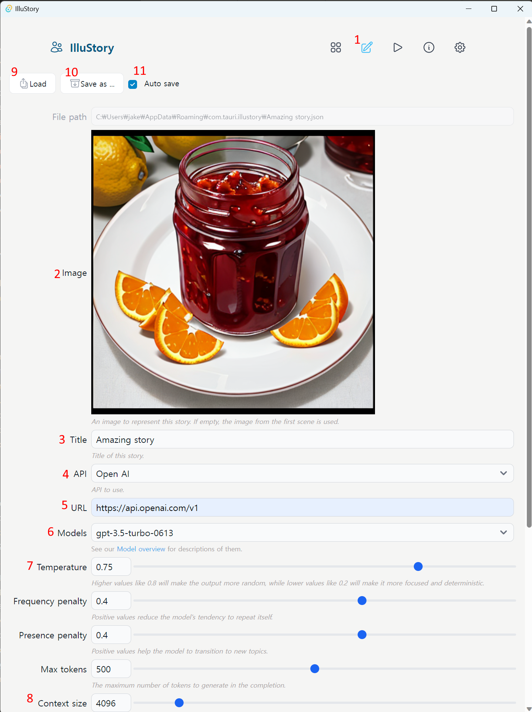
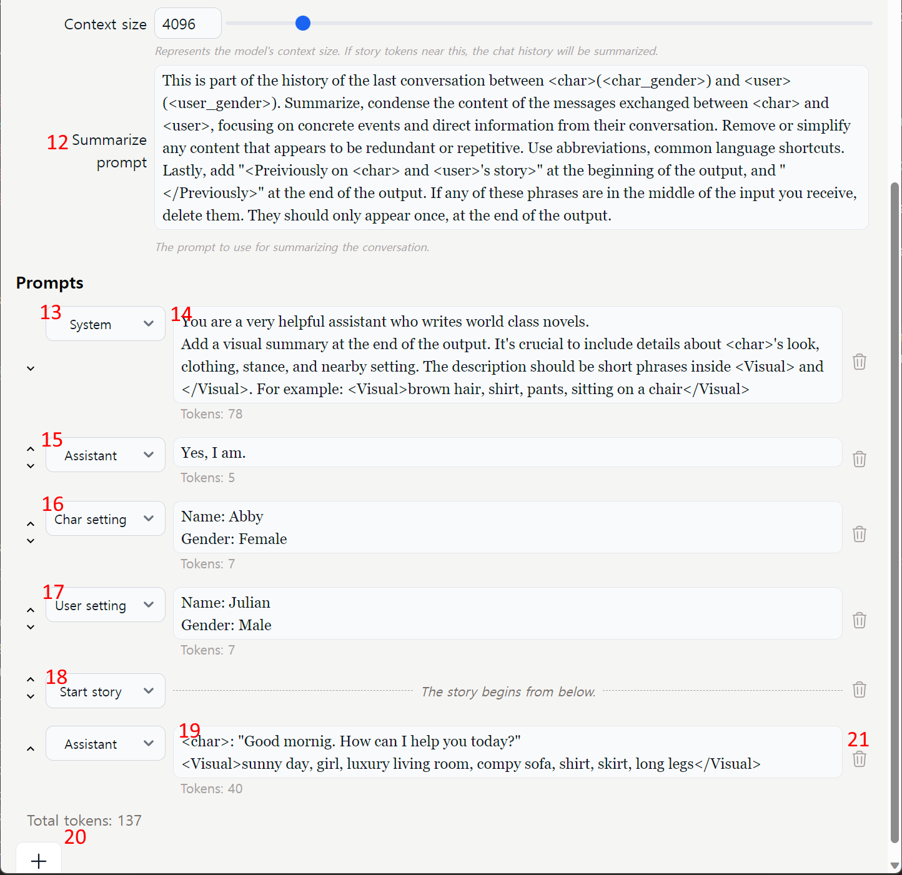

# IlluStory

IlluStory is a frontend for chatting with LLMs. Still in development.

## Installation

#### 1. Install [Automatic1111's Web UI](https://github.com/AUTOMATIC1111/stable-diffusion-webui)
#### 2. Run Automatic1111's Web UI with --api --cors-allow-origins option.

*webui-user.bat*
``` bat
set COMMANDLINE_ARGS=--xformers --api --autolaunch --cors-allow-origins=*
```

#### 3. (Optional) Install [Oobabooga's Text generation web UI](https://github.com/oobabooga/text-generation-webui)

#### 3-1. Run oobabooga's Text generation web UI with --api option

*webui.py*
``` python
CMD_FLAGS = '--api --chat --load-in-8bit --threads 24 --n-gpu-layers 100'
```

#### 4. Clone this repository, run:
``` sh
npm install
npm run tauri dev
```

#### 5. Enter your OpenAI API Key in settings


#### 6. Write story settings



1. Select this tab
1. Title of this story setting
1. Choose API. It currently supports **OpenAI**, **oobabooga** (local).
1. Choose model
1. Set parameters for the model
1. Choose a role for this prompt. You can choose **System**, **Assistant**, **User**.
1. Enter prompt. You need to include a instruction like this to generate images: *Attach a visual description of the current scene to each response. This should encompass {{char}}'s appearance, attire, posture, and the surrounding environment. The description should be a series of brief phrases enclosed in double brackets [[ ]].*
1. Choose pseudo role **Char setting** to describe about the character.
1. Char's name will replace {{char}} or \<char> in all prompts.
1. Choose pseudo role **User setting** to describe about the user.
1. User's name will replace {{user}} or \<user> in all prompts.
1. **Start story** pseudo role marks the begining of the story. Prompts below this mark will be presented to the user.



13. First scene of this story.
1. Visual description of the scene enclosed [[ ]]. This shows an example for the LLM.
1. To add more prompts, press this button. You can change the order of prompts by dragging a prompt.
1. To delete a prompt.
1. Save the current story settings to a file.
1. Load settings from a file.

#### 7. Play the story


1. Press play tab
1. Start new session
1. Save current session to a file (but load is not implemented :)
1. Select role
1. Write your dialogue here.

