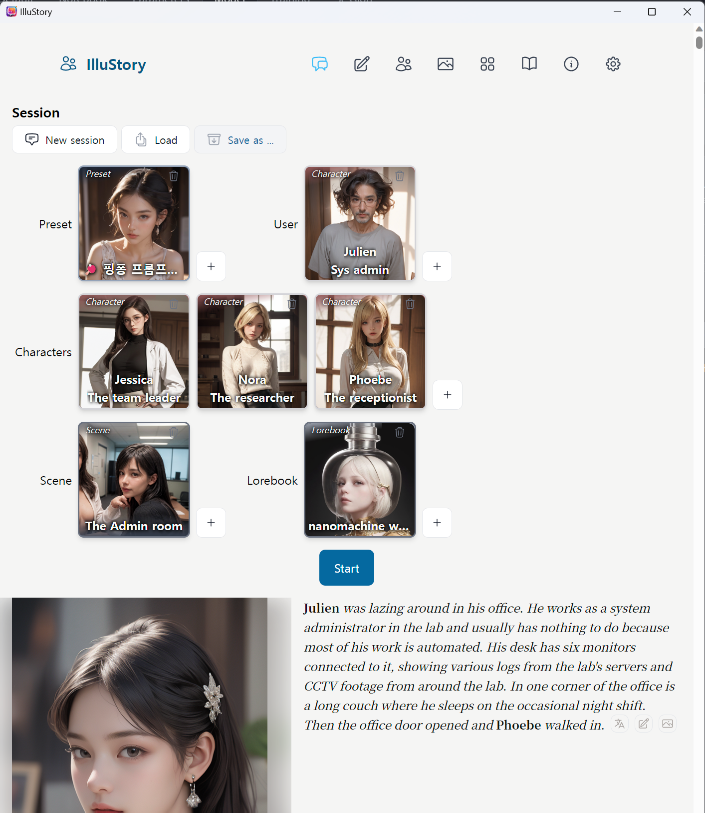

# IlluStory

IlluStory is a frontend for chatting with LLMs. It focuses on generating images from
[Automatic1111's Web UI](https://github.com/AUTOMATIC1111/stable-diffusion-webui) and
showing them alongside text generated by Open AI,
[oobabooga](https://github.com/oobabooga/text-generation-webui),
or [Koboldcpp](https://github.com/LostRuins/koboldcpp).

## Installation

#### 1. Install [Automatic1111's Web UI](https://github.com/AUTOMATIC1111/stable-diffusion-webui) for image generation.

#### 1-1. After installation, edit `webui-user.bat` to run Automatic1111's Web UI with --api option.

_webui-user.bat_

```bat
set COMMANDLINE_ARGS=--xformers --api --autolaunch
```

#### 1-2. Run `run.bat`, choose **Extensions** tab, install ADetailer extension for better image quality.


#### 1-3. Download some image model(eg. from [civitai](https://civitai.com/models/201673/kakarot-28d-color)), place it under `webui/models/Stable-diffusion` foler and choose it.


#### 2. For text generation, IlluStory supports the following backends.

- [Open AI api](https://platform.openai.com/docs/overview)
- [Oobabooga's Text generation web UI](https://github.com/oobabooga/text-generation-webui)
- [Koboldcpp](https://github.com/LostRuins/koboldcpp)

Open AI api requieres payments, refer to their [pricing](https://openai.com/pricing) page.
If you have a decent hardware you can run LLM on your own machine using oobabooga or koboldcpp.
Koboldcpp is a single exe, easy to install.

#### 2-1. For Open AI api

You need to get API key from them.


#### 2-2. For oobabooga

- Install it using one-click installer.
- Edit `CMD_FLAGS.txt` to enable api

_CMD_FLAGS.txt_

```bat
--api
```

- Run `start_windows.bat` (or `start_macos.sh`,`start_linux.sh` depending on your OS)
- Choose model tab, download a model.


- Choose the downloaded model, set **max_seq_len** and **alpha**, and load it.


#### 2-3. For koboldcpp

- Download [koboldcpp](https://github.com/LostRuins/koboldcpp/releases)
- Download some model (eg. [openhermes-2.5-mistral-7b.Q8_0.gguf](https://huggingface.co/TheBloke/OpenHermes-2.5-Mistral-7B-GGUF/blob/main/openhermes-2.5-mistral-7b.Q4_0.gguf)) and run

```cmd
.\koboldcpp.exe --contextsize 8192 --usecublas 0 --gpulayers 43 --model .\model\openhermes-2.5-mistral-7b.Q4_0.gguf
```

Adjust `--gpulayers 43` depending on your GPU's VRAM size.

#### 3. Download IlluStory from https://github.com/Julian-adv/IlluStory/releases, run IlluStory.

#### 4. (If you are a developer, and want to modify my codes) Clone this repository, run:

```sh
npm install
npm run tauri dev
```

#### 5. Enter your OpenAI API Key in settings


#### 6. Enter your DeepL API key in settings (if you want automatic translation)


You can get DeepL api key [here](https://www.deepl.com/pro-api). It's free for 500,000 characters per month.

#### 7. Choose options


- If you're running oobabooga and Stable Diffusion at same time, its URL is changed to http://localhost:7861
- Choose your language for DeepL translation(_User language_)


- Choose font/color for your preference.

## How to chat

### Choose cards for a chatting session



I included examples of a preset card, an user card, a character card, and a scene card.
Press `+` button and choose card. After choosing all cards, press **Start**.


- If you have installed Automatic1111's Web UI, it will generate and show an image from the
  scene description.
- If you don't like the image, press  or . It will regenerate a image.
- To translate message, press 
- If you want to edit parts of AI's output, press 
- If you want to regenerate AI's output completely, press **Back**. You can go back up to the first message.

### Multiple characters

- If you put multiple character cards into the character slot, there will be drop down menu to select
  next speaker.
  
  
- If you select **Random**, next character is selected by random. If you select a specific char,
  `{{char}}` will be replaced by that character.
- Next character is changed automatically as you enter your prompt.

## How to write prompts

Select write tab to write a system prompt.


### Visualization mode


There are 3 visualization modes.

- None

  - It does not generate any image.

- RegExp

  - It extracts an image description from the output of AI. The first matching group of the regexp are
    used as a prompt for Stable Diffusion image generation.
  - For example, if regexp is `\[.*?Location: *(.*?)\]` and AI output is like this:
    
    It will pass the following to Stable Diffusion. (the first matching group of regexp)

    > Julien's office, cluttered with technology and papers strewn about.
    > The hum of computer servers fills the air. | Phoebe's appearance: Her long blonde hair is neatly
    > arranged, her blouse is a crisp white paired with a charcoal skirt and matching stockings.
    > She stands just inside the door, a hint of nervousness in her posture.

  - You need to instruct the AI to generate formatted outputs exactly for this method to work correctly.
    Some low intelligent AI models can't follow these instructions and fail to generate messages
    formatted properly. In that case use **Whole Text** method.
  - Here is an example prompt for the above generation
    

- Whole Text
  - It uses whole output of AI as a prompt for image generation.
- Generate
  - It prompts AI to generate a visual description of the current scene and uses the output of AI
    for the prompt to generate image. So it will take more time, and costs more tokens.

### Prompt roles

- Basically there are 3 roles (system, assistant, and user) you can choose for each prompt.
  It will be passed to the backend model as is.
  
- There are some other pseudo roles(char setting, user setting, etc.) which are processed and replaced
  before passing to the backend model.

### Char setting role


- If you put something in _Tag_ field, each character description will be enclosed by `<tag>`
  before sending to AI. So above case will be:

```
<Character Profile>
Name: Julien
Gender: Male
Blah blah
</Character Profile>
```

- User setting role is similiar.

### Lorebook role

- Content of lorebook will be placed here.
  
- Whenever AI generates outputs, the first non triggered lorebook rule will be asked to AI.
  
- If the answer of AI is matching the _Answer_ field, content of that rule will be inserted in the prompt
  in the place of lorebook role.
- So it consumes more tokens and time, you need to be careful.
- To save time and tokens, the client asks only one question(the first one not triggered yet.).
  After triggering, it do not ask the question again.
- Purpose of this scheme is not to inform AI before the actual event. Because AI is not good at
  keeping the secrets from the user.
- I will add more conventional keyword matching based lorebook rules later.

### Assoc Memory role

- As your chatting gets longer than your model's context size, old chats are removed from
  chat history, splitted into sentences and saved into vector db.
- When you enter new prompt, most relevant old chat is searched and inserted in this place.
  
- You can control how many old sentences are retrieved and inserted here by changing
  _Number of scenes_ field.
- It currently uses `chromadb` for embedding and vector db, I have a plan to add Open AI's embedding model.

### Chat history role


- Chat history is inserted here.
- You can specify the range of history, 0 means beginning of history(old chat), `end` means end
  of history(your last input).
- -1 means counted from end. So example above will insert your last input.

### Special placeholders

- The following placeholders are replaced with a correspondng value before sending to AI.

  | placeholder     | value                             |
  | --------------- | --------------------------------- |
  | {{char}}        | character name                    |
  | {{user}}        | user name                         |
  | {{char_gender}} | character's gender (male, female) |
  | {{user_gender}} | user's gender (male, female)      |
